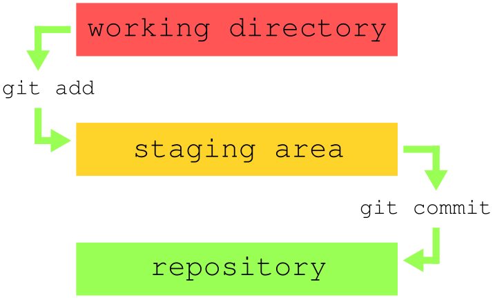
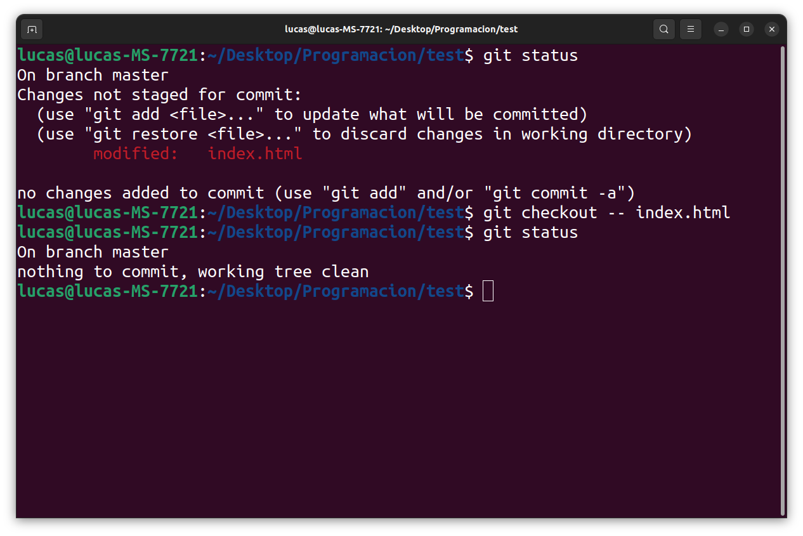
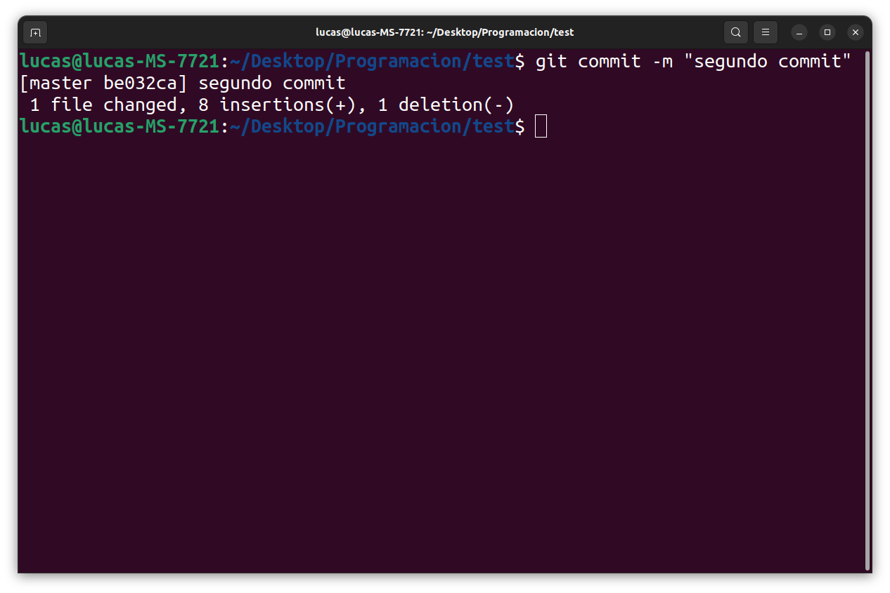

# Guia basica de GIT

***
### Indice

1. [¿Qué es GIT?](#¿Qué-es-GIT?)
2. [Conceptos clave](#Conceptos-clave)
3. [Comandos básicos](#Comandos-básicos)
4. [Como iniciar GIT](#Como-iniciar-GIT)
5. [Empezar con GIT](#Empezar-con-GIT)
6. [Como continuar trabajando](#Como-continuar-trabajando)
7. [Ignorar archivos](#Ignorar-archivos)
8. [Versiones alternativas del código](#Versiones-alternativas-del-código)
9. [Comandos útiles](#Comandos-útiles)
10. [Subir repositorio a GitHub](#Subir-repositorio-a-GitHub)
11. [Clonar repositorios](#Clonar-repositorios)
12. [Archivo README](#Archivo-README)

***
## ¿Qué es GIT?
Es un sistema de control de versiones de nuestros programas o proyectos.

Es un sistema de control distribuido, es decir, multiples desarrolladores podrán manipular el repositorio en el cual se esta trabajando pero todos teniendo una copia local del mismo.

Controla los cambios ya que almacena todas las versiones anteriores que sean guardadas, pudiendo regresar a estas.

## Conceptos clave
- Te provee una manera de seguir los cambios de tu código.
- Toma “snapshots” del código, esto quiere decir que podemos guardar nuestro código y revisarlo en ese punto independientemente de cuantos cambios hallamos hecho.
- Tú decides cuando realizar estas “snapshots”, creando así un commit.
- Puedes revisar estas estas “snapshots” cuando gustes y navegar entre ellas.
- Puedes seguir agregando archivos y modificaciones de los mismos a cualquier “snapshot”

**3 estados principales:**

- **working directory:** es donde nosotros trabajamos todos nuestros archivos, donde realizamos las modificaciones y añadimos o quitamos lineas de código.
- **staging area:** es donde agregamos los archivos ya trabajados, con las modificaciones y las preparamos para subirlas al repositorio. Es donde podemos preparar las distintas “snapshots”.
- **repository:** son esas “snapshots”, puntos de guardado de nuestro código al que podemos regresar tantas veces queramos.

## Comandos básicos
- `git init` → inicializar git en ese proyecto, ya sea desde cero o continuando una instancia previa.
- `git add <nombre>` → pasar los archivos del *working directory* al *staging area.*
- `git status` → para ver en que estado están nuestros archivos.
- `git commit` → pasar los archivos del *staging area* al *repository.*
- `git push` → subir nuestro *repository* a un *repositorio remoto* en un servidor.
- `git pull` → en caso de ser multiples desarrolladores, traes todos los cambios que hayan hecho.
- `git clone` → realiza una copia del servidor central a nuestro ordenador de forma local.

## Como iniciar GIT
Navegamos desde la consola hacia la carpeta de nuestro proyecto, una vez en esta, realizamos el comando de `git init` para iniciar una instancia.

Esto creará una carpeta oculta llamada **.git/** donde se almacenaran todos nuestros commits.

## Empezar con GIT
Una vez iniciado git en nuestro proyecto, podemos utilizar `git status` para ver el estado de nuestros archivos.

Podemos ver que git nos dice que hay archivos que no están siendo “seguidos”, esto quiere decir que no pertenecen a ningún commit y que sus cambios no serán guardados, por lo que debemos incluirlos con `git add`.

Como podemos observar, con `git add <file>` (donde `<file>` va el nombre del archivo) añadimos el archivo deseado a nuestro *staging area,* pero solo es agregado ese archivo especificado, el resto de nuestros archivos aun están sin agregar.

Como en este caso, al ser varios archivos, en vez de tener que introducir uno por uno podemos agregar todos a la vez utilizando `git add .` (poniendo un . en lugar de los nombres de los archivos)

Ahora todos nuestros archivos están en nuestro staging area y listos para crear nuestro primer commit, snapshot o punto de guardado. Esto lo realizamos con `git commit`

Pero como podemos ver, al ser el primer commit que creamos debemos configurarlo. Decirle a git quien es el que esta realizando los cambios.

Una vez ingresados ambos comandos, tanto `git config —global user.email/name` podemos utilizar ahora si `git commit`

Nos aparecerá el editor de texto vim donde podremos ingresar el nombre que queramos de nuestro commit.

Una vez realizado todo podremos ver todos los archivos que se cargan (en este caso 3)

Podemos observar la información de nuestros commits con `git log`

En este punto, si hacemos un `git status` podemos observar que no hay mas cambios por realizar, ya que todos nuestros archivos están actualizados en el ultimo commit.

## Como continuar trabajando
a pudimos realizar nuestro primer commit, esto da nuestro punto de inicio en nuestro proyecto, pero al realizar modificaciones en nuestro código debemos ir creando nuevas “snapshots” del mismo en todos los puntos importantes.

Si, por ejemplo, realizamos algún cambio en nuestro código, el cual no esta guardado en ningún commit, podemos revertirlo facilmente con `git checkout — <nombre del archivo modificado>`

De esta forma borramos todos los cambios realizados que no hayan sido guardados.

Ahora, para ver las diferencias entre el archivo guardado y el modificado, lo podemos hacer con `git diff`

Las lineas en rojo y con un - adelante son las lineas quitadas y las lineas en verde con un + adelante son las lineas agregadas.

Pero para guardar estos nuevos cambios, es similar al principio, se hace con `git add`  para añadir este archivo a nuestro *staging area.*

De igual forma que antes, creamos otro commit con `git commit`, el cual conservara estos cambios.

Ahora bien, si utilizamos el comando `git log`, podremos ver tanto el ultimo commit creado como el primero, cada uno con su respectivo id y su información, así también como en cual no encontramos actualmente *(HEAD -> master)*

De esta manera podemos agregar todos los archivos nuevos o modificaciones de los mismos que deseemos, cuantas veces queramos, creando así todos los commits necesarios, estos se guardaran y podrán ser accedidos a gusto en un futuro.

## Ignorar archivos
Supongamos que tenemos una carpeta o archivos que deseamos omitir, donde hacemos algunas pruebas pero que no deseamos guardar en nuestro commit. Estos archivos se pueden ignorar usando un archivo especial de git llamado **.gitignore**, donde debemos escribir dentro de el, el nombre de todos los archivos y/o carpetas que deseamos que git ignore.

Como se puede ver, primero teníamos una carpeta llamada pruebas/, luego creamos el archivo **.gitignore** y dentro del mismo colocamos el nombre de la carpeta o de todos los archivos que deseamos ignorar, esto hará que git ignore completamente esos archivos para añadirlos al commit, lo único que si hay que añadir al commit es el **.gitignore** ya que de no tenerlo git volvería a reconocer esos archivos que no deseamos guardar.

## Versiones alternativas del código
Hasta ahora todos los cambios realizados fueron hechos en una sola linea, osea, fuimos cambiando nuestro código, haciendo varios commits pero todos en un proyecto principal al que git llama *master.*

Esto lo podemos ver utilizando el comando `git branch`

Pero si quisiéramos hacer una copia de nuestro código, para poder modificarlo todo lo que quisiéramos sin miedo a perder nada, podemos hacer un nuevo *branch,* esto quiere decir que habría una “segunda linea de código” en el cual podemos saltar de un punto a otro sin ningún problema.

Podemos crear este segundo branch con `git branch <nombre del nuevo branch>`

Para cambiar entre una linea y otra, lo podemos hacer con `git checkout <nombre del branch>`

Todos los cambios realizados en un branch solo afectan a ese único branch, los otros quedaran exactamente igual que como se quedaron desde su ultima actualización. 

Cualquier commit creado en un branch solo existirá en ese branch unicamente.

## Comandos útiles
- `git add .` → añade todos los archivos que no estén en el staging area de una sola vez.
- `git commit -m “nombre del commit”` → evita abrir el editor para añadir el nombre del commit y lo hace automáticamente con el parámetro ingresado entre comillas.
- `git log` → permite ver todos los commits realizados hasta el momento.
- `git checkout — <nombre del archivo modificado>`  → permite volver al estado del ultimo commit guardado al archivo que se haya modificado.
- `git diff` → permite ver las diferencias entre el archivo como estaba guardado en el ultimo commit y como se encuentra actualmente.
- `git branch` → permite ver todos los branch existentes.
- `git branch <nombre del nuevo branch>` → permite crear un nuevo branch con el nombre dado.
- `git checkout <nombre del branch>` → permite cambiar de branch hacia el que tenga el nombre ingresado.

## Subir repositorio a GitHub
En [GitHub](https://github.com/) podemos subir nuestros repositorios, todos nuestros proyectos y también acceder a proyectos de otras personas.

Cuando creamos un nuevo repositorio, se sube tanto nuestro código como todas las versiones y commits del mismo, al cual podrán acceder cualquier persona.

Una vez creado el repositorio, obtendremos una *url* del mismo donde se almacenara.

En el caso de que el proyecto sea nuevo, debemos inicializar git como ya sabemos, crear un commit y por ultimo utilizar el comando que nos da GitHub que es `git remote add origin <url>` para preparar el proyecto para subir a esa url.

Luego utilizamos el comando `git push -u origin main` para subir el repositorio. 

Una vez realizado todo esto podemos ver como el código se encuentra disponible en la url anteriormente mencionada.

## Clonar repositorios
Podemos descargar repositorios desde GitHub copiando la url del mismo y utilizando el comando `git clone <url>`

## Archivo README
El archivo README es donde se da la descripción de nuestro proyecto, se especifican todas las partes y se utiliza para que otras personas puedan entender mas facilmente de que trata el proyecto leyendo directamente este archivo.

Se utiliza el lenguaje de marcado **Markdown** para la estructuración del mismo.
